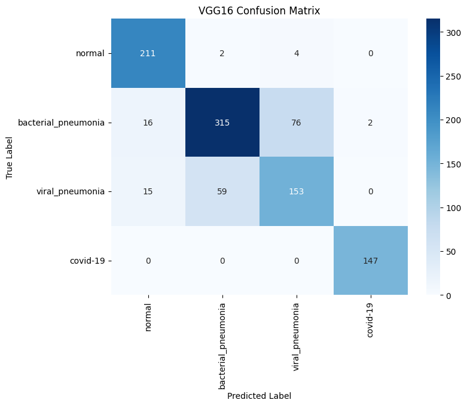
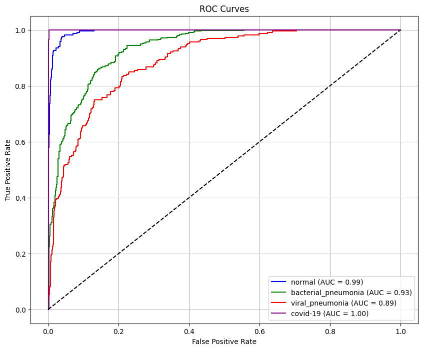
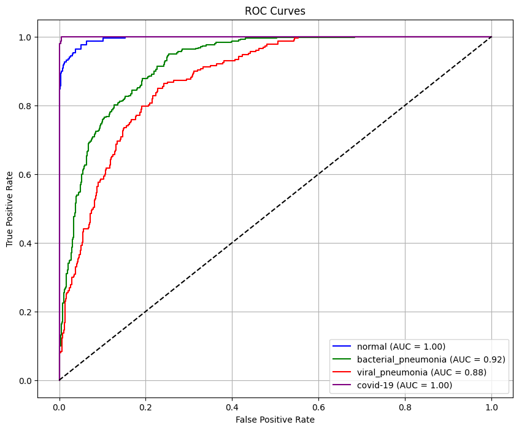
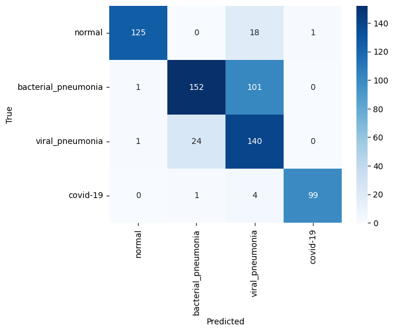
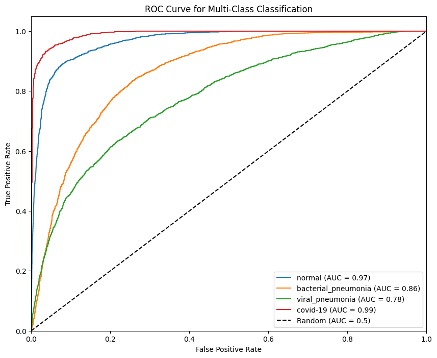

# 🧠 TRANSFER LEARNING FOR RESPIRATORY DISEASE CLASSIFICATION IN CHEST X-RAYS
  - A Comparative Analysis of Transfer Learning vs. a From-Scratch Approach

# Objectives
 - To prepare a comprehensive dataset of chest X-ray images for classification.
 - To establish a baseline by training a Custom CNN from scratch.
 - To implement and fine-tune a VGG16 model using Transfer Learning (VGG16 & ViT B/16).
 - To implement and fine-tune a Vision Transformer (ViT) model using Transfer Learning.
 - To conduct a rigorous comparative analysis of all three models on performance and efficiency.

# METHODOLOGY: OVERALL WORKFLOW
  1. Data Collection
  2. Data Preprocessing and Augmentation
  3. Data Splitting
  4. Setting Baseline by Training a Model from Scratch
  5. Model Implementation via Transfer Learning
  6. Model Training
  7. Performance Evaluation
  8. Comparative Analysis

# RESULTS

VGG 16

ViT

Custom Model

