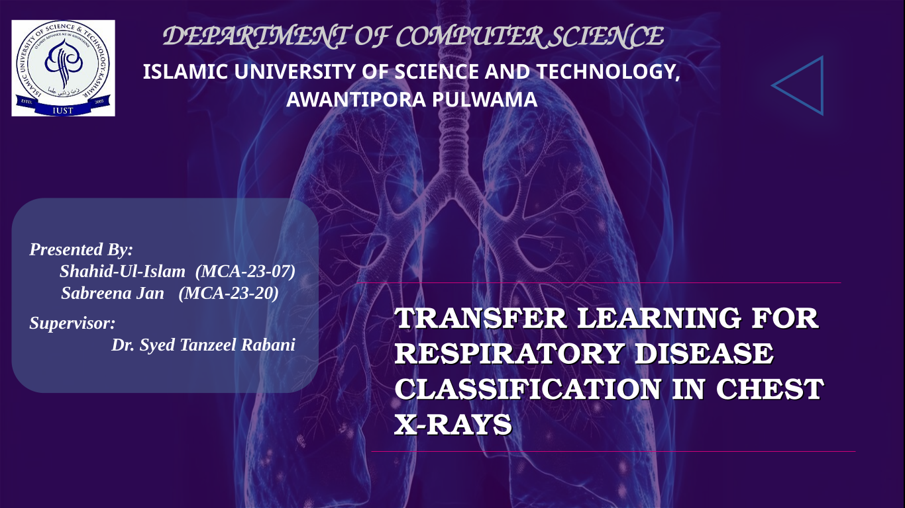

# 🧠 Transfer Learning for Medical Imaging: Classification & Segmentation


This repository contains all code, results, visualizations, and documentation related to a project evaluating transfer learning techniques for medical image classification and segmentation tasks.

## 📌 Project Overview

This project investigates the effectiveness of transfer learning compared to training-from-scratch for medical image analysis, using both chest X-ray classification and tuberculosis lung segmentation as case studies.

We evaluate various CNNs and Vision Transformers (ViTs) across multiple metrics—accuracy, AUC, IoU, Dice—and analyze their computational efficiency to provide practical recommendations for real-world medical AI applications.

---

## 🎯 Objectives

- Compare transfer learning vs. training-from-scratch.
- Evaluate model performance on classification and segmentation.
- Measure training time and resource usage.
- Identify optimal model choices based on dataset size and task type.
- Provide guidelines for deploying AI in low-resource medical settings.

---

## 🛠️ Tech Stack

| Category          | Tools Used                                 |
|------------------|---------------------------------------------|
| Programming       | Python 3.x                                 |
| Deep Learning     | TensorFlow, PyTorch                        |
| Image Processing  | OpenCV, scikit-image                       |
| Evaluation        | scikit-learn, matplotlib, seaborn          |
| Hardware          | Local GPUs, Google Colab, AWS, Paperspace  |

---

## 📂 Project Structure

```
├── data/ # Datasets (download links or references)
├── notebooks/ # Jupyter notebooks for experiments
├── src/ # Model training, evaluation, and utils
├── results/ # Metrics, plots, visualizations
├── presentation/ # Final PPT, images, speaker notes
├── reports/ # Analysis summaries, README, final PDF
└── README.md # You are here!
```

---

## 📊 Datasets Used

- **Classification**: Chest X-ray images from Kaggle (COVID-19, Pneumonia, Normal)
- **Segmentation**: TB lung segmentation masks dataset

> Due to licensing, datasets are not uploaded. Please refer to `data/README.md` for download instructions.

---

## 📈 Key Results

- Transfer learning significantly improves performance in low-data settings.
- Fine-tuned ViTs offer better generalization for classification.
- U-Net with pretrained backbones outperformed scratch models in segmentation.
- Training time and GPU usage were much lower for transfer learning.

---

## 📘 Deliverables

- ✔️ Final Presentation (PPTX + PDF)
- ✔️ Open-source codebase with reproducible experiments
- ✔️ Performance benchmarks for multiple models
- ✔️ Visualizations (charts, diagrams)
- ✔️ Guidelines for model selection in medical imaging tasks

---

## 📄 License

This project is open-source under the Apache 2.0 License. See `LICENSE` file for details.

---

## 🙋‍♂️ Contact

**Author**: *Shahid Ul Islam*  
📫 Email: [shahid9664@gmail.com]  
🔗 Portfolio: [https://khanz9664.github.io/portfolio]  
